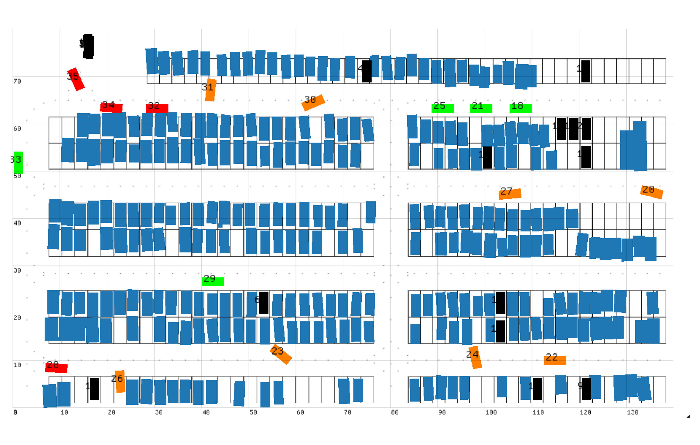

# ParkSim


Vehicle simualtion and behavior prediction in parking lots. This is a monorepo with different projects mixed-in.

Authors: Xu Shen (xu_shen@berkeley.edu), Alex Wong, Neelay Velingker, Matthew Lacayo, Nidhir Guggilla

## [ParkPredict+](https://arxiv.org/abs/2204.10777)

ParkPredict+: Multimodal Intent and Motion Prediction for Vehicles in Parking Lots with CNN and Transformer

Authors: Xu Shen, Matthew Lacayo, Nidhir Guggilla, Francesco Borrelli

<div align=center>
  
  
</div>

### Install
1. Clone this repo
2. In the [setup.py](https://github.com/XuShenLZ/ParkSim/blob/main/python/setup.py) script, enable the following packages
    - `tensorboard`
    - `pytorch_lightning`
    - `einops`
3. In the `/python` folder of this repo, do `pip install -e .` (A virtualenv is recommended)
4. If components of [DLP dataset](https://github.com/MPC-Berkeley/dlp-dataset) is needed, install the DLP package and request data according to the instructions there.
5. Install `pip install` the correct [pytorch](https://pytorch.org/) version into this virtualenv based on your OS and hardware.

### Usage

1. A pre-trained intent prediction model can be [downloaded here](https://drive.google.com/file/d/1LVQJRQmjGfGchxhMRchiZRCjrlFDVch-/view?usp=sharing).
2. A pre-trained trajectory prediction model can be [downloaded here](https://drive.google.com/file/d/1c9KQXwFMRIYPJo1sXJKepoBcrEme_HxU/view?usp=sharing).

Use [this notebook](https://github.com/XuShenLZ/ParkSim/blob/main/python/parksim/trajectory_predict/intent_transformer/testing_multimodal.ipynb) to evaluate the pre-trained models.

See [this page](https://github.com/XuShenLZ/ParkSim/tree/main/python/parksim/trajectory_predict) for information about training.

## [Fleet Parking](https://arxiv.org/abs/2402.14183)

Parking of Connected Automated Vehicles: Vehicle Control, Parking Assignment, and Multi-agent Simulation

Authors: Xu Shen, Yongkeun Choi, Alex Wong, Francesco Borrelli, Scott Moura, Soomin Woo

<div align=center>

</div>

### Configuration

#### File Preparation

1. In your BASE folder, clone this repository
2. Go back to the BASE level, clone the [DLP dataset](https://github.com/MPC-Berkeley/dlp-dataset) repository
3. Now your folder structure should look be:
```
BASE
    – ParkSim
    – dlp_dataset
```
4. Extract the attachment zip [from this link](https://drive.google.com/file/d/1XUUQ7sk8hZapyGFFH-_4R1Dg4FwVpSJD/view?usp=sharing)
5. Create a folder `dlp-dataset/data`, move the files `DJI_0015_*.json` into it, i.e.
```
BASE
    – ParkSim
    – dlp_dataset
        — data
            – DJI_0015_*.json
```
6. Create a folder `ParkSim/data`, move the rest of the files into it, i.e.
```
BASE
    – ParkSim
        – data
            – other_files_in_the_zip
    – dlp_dataset
        – data
            – DJI_0015_*.json
```

### Install

1. create a virtual environment and activate it
2. Enter the `ParkSim/python` folder
3. Run `pip install -e .` to install `parksim` package
4. With the current virtualenv activated, go into the `dlp-dataset` folder and run `pip install -e .` to install the `dlp` package into the same env
5. Install `pip install` the correct [pytorch](https://pytorch.org/) version into this virtualenv based on your OS and hardware.

### Test
1. With the virtualenv activated, run `python python/parksim/simulator/rule_based_simulator.py` to run the simulation
2. You can change different simulation settings with [this yaml file](https://github.com/XuShenLZ/ParkSim/blob/main/python/parksim/simulator/sim_params.yaml)


> **Note**: If you are testing within a WSL2 system with Windows built-in WSLg, and cannot see any GUI after simulation starts, try setting `export LIBGL_ALWAYS_SOFTWARE=1` before running it.

> **Note**: The ROS-related code is out-of-sync with the project development.